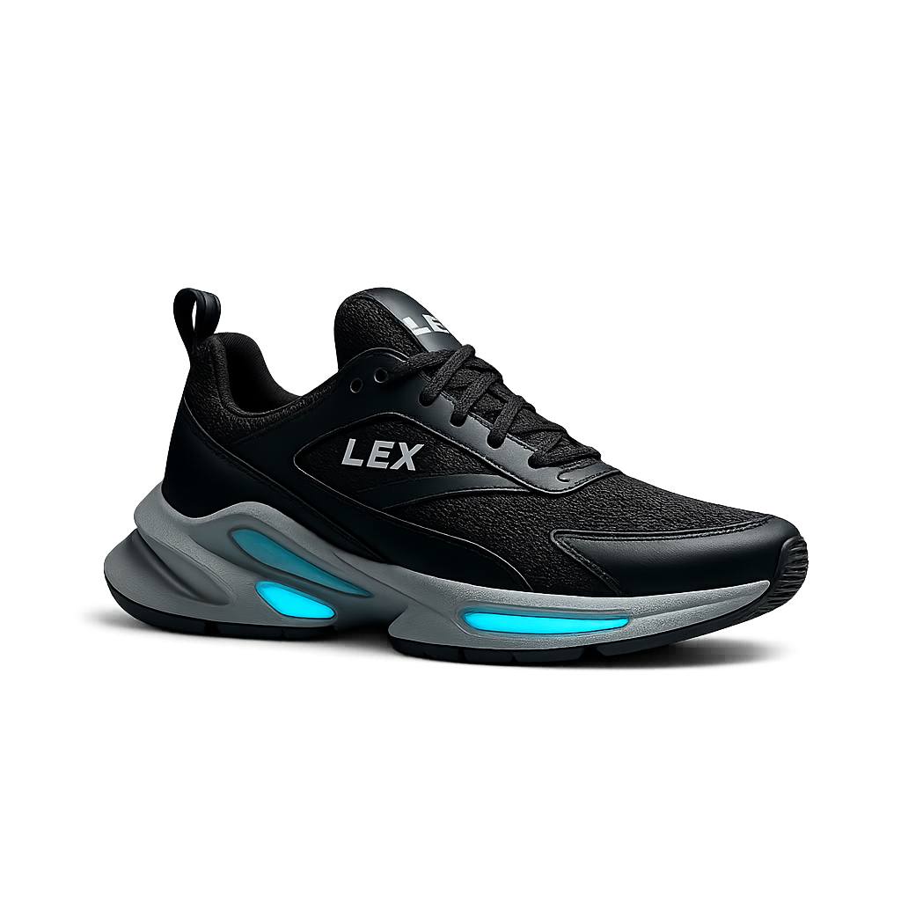

# LEX - Premium Sneaker Landing Page



## 🚀 Project Overview

LEX is a modern, responsive landing page for a premium sneaker brand that combines cutting-edge design with exceptional user experience. Built with a focus on performance, accessibility, and visual appeal, this project showcases the future of footwear e-commerce.

**Live Demo**: [View Project](#) <!-- Add your live demo link here -->

## ✨ Features

### 🎨 **Modern Design System**
- **Responsive Design**: Fully responsive across all devices (mobile, tablet, desktop)
- **Dark/Light Mode**: Intelligent theme switching with user preference persistence
- **Smooth Animations**: CSS3 animations and transitions for enhanced UX
- **Typography**: Custom Google Fonts (Space Grotesk) for modern aesthetics

### 🛠️ **Interactive Components**
- **Hero Slideshow**: Auto-rotating image carousel with manual controls
- **Mobile Navigation**: Collapsible hamburger menu with smooth transitions
- **Contact Forms**: Functional contact form with validation
- **Live Chat Widget**: Integrated chat interface for customer support
- **Story Toggle**: Expandable brand story section

### 🔧 **Technical Excellence**
- **SEO Optimized**: Schema.org markup, semantic HTML, meta tags
- **Performance**: Lazy loading images, optimized assets, fast load times
- **Accessibility**: ARIA labels, keyboard navigation, screen reader support
- **Cross-browser**: Compatible with all modern browsers

## 🏗️ **Project Structure**

```
LEX/
├── index.html                 # Main HTML file
├── README.md                  # Project documentation
├── assets/
│   ├── css/                   # Stylesheets
│   │   ├── main.css          # Global styles and variables
│   │   ├── hero.css          # Hero section styles
│   │   ├── features-enhanced.css # Features section
│   │   ├── about.css         # About section
│   │   ├── contact.css       # Contact section
│   │   ├── footer.css        # Footer section
│   │   └── mobile-features.css # Mobile-specific styles
│   ├── js/                    # JavaScript files
│   │   ├── main.js           # Core functionality
│   │   └── hero.js           # Hero slideshow logic
│   └── imges/                 # Image assets
│       ├── HEROPIC.png       # Hero images
│       ├── shoe1 (1-4).png   # Product images
│       ├── lexshoe5 (1-4).png # Product variants
│       └── freepik__*.png    # Lifestyle photography
├── .kiro/                     # Development specs
│   └── specs/                 # Feature specifications
└── docs/                      # Additional documentation
```

## 🛠️ **Technologies & Tools Used**

### **Frontend Technologies**
| Technology | Purpose | Implementation |
|------------|---------|----------------|
| **HTML5** | Structure & Semantics | Semantic markup, Schema.org microdata |
| **CSS3** | Styling & Animations | Flexbox, Grid, Custom Properties, Animations |
| **JavaScript (ES6+)** | Interactivity | DOM manipulation, Event handling, Local storage |

### **CSS Frameworks & Libraries**
| Tool | Purpose | Usage Location |
|------|---------|----------------|
| **Normalize.css** | Cross-browser consistency | Global reset styles |
| **Google Fonts** | Typography | Space Grotesk font family |
| **Font Awesome** | Icons | Navigation, buttons, social links |

### **Development Tools**
| Tool | Purpose | Usage |
|------|---------|-------|
| **VSC IDE** | Development Environment | Code editing, file management |
| **Git** | Version Control | Source code management |
| **Browser DevTools** | Debugging | Performance optimization, responsive testing |

## 📱 **Responsive Breakpoints**

```css
/* Mobile First Approach */
Mobile:    320px - 768px
Tablet:    768px - 1024px
Desktop:   1024px - 1440px
Large:     1440px+
```

## 🎨 **Design System**

### **Color Palette**
```css
:root {
  /* Primary Colors */
  --primary-color: #000000;
  --secondary-color: #ffffff;
  --accent-color: #ff6b35;
  
  /* Neutral Colors */
  --gray-100: #f8f9fa;
  --gray-200: #e9ecef;
  --gray-800: #343a40;
  --gray-900: #212529;
  
  /* Theme Colors */
  --background-light: #ffffff;
  --background-dark: #1a1a1a;
  --text-light: #333333;
  --text-dark: #ffffff;
}
```

### **Typography Scale**
```css
/* Font Sizes */
--font-size-xs: 0.75rem;    /* 12px */
--font-size-sm: 0.875rem;   /* 14px */
--font-size-base: 1rem;     /* 16px */
--font-size-lg: 1.125rem;   /* 18px */
--font-size-xl: 1.25rem;    /* 20px */
--font-size-2xl: 1.5rem;    /* 24px */
--font-size-3xl: 1.875rem;  /* 30px */
--font-size-4xl: 2.25rem;   /* 36px */
```

## 🔧 **Key Features Implementation**

### **1. Hero Section**
- **Location**: `index.html` (lines 120-210)
- **Styles**: `assets/css/hero.css`
- **JavaScript**: `assets/js/hero.js`
- **Features**:
  - Auto-rotating slideshow (4 images)
  - Manual navigation indicators
  - Responsive image optimization
  - Floating animation elements

### **2. Navigation System**
- **Location**: `index.html` (lines 35-115)
- **Styles**: `assets/css/main.css`
- **JavaScript**: `assets/js/main.js`
- **Features**:
  - Responsive hamburger menu
  - Smooth scroll navigation
  - Dark/light mode toggle
  - Mobile-optimized layout

### **3. Features Section**
- **Location**: `index.html` (lines 215-350)
- **Styles**: `assets/css/features-enhanced.css`
- **Features**:
  - 6 unique feature cards
  - Different visual styles (image, icon, gradient, minimal, eco, tech)
  - Hover animations and interactions
  - Mobile-responsive grid layout

### **4. About Section**
- **Location**: `index.html` (lines 355-450)
- **Styles**: `assets/css/about.css`
- **JavaScript**: Story toggle functionality
- **Features**:
  - Schema.org structured data
  - Expandable brand story
  - Key differentiators showcase
  - Accessibility-compliant markup

### **5. Contact Section**
- **Location**: `index.html` (lines 455-650)
- **Styles**: `assets/css/contact.css`
- **Features**:
  - Multi-field contact form
  - Live chat widget interface
  - Support hours display
  - Form validation and honeypot spam protection

### **6. Footer Section**
- **Location**: `index.html` (lines 655-900)
- **Styles**: `assets/css/footer.css`
- **JavaScript**: Mobile accordion functionality
- **Features**:
  - 4-column responsive layout
  - Featured products showcase
  - Social media integration
  - Mobile accordion navigation

## 🚀 **Performance Optimizations**

### **Image Optimization**
- **Lazy Loading**: All images below the fold use `loading="lazy"`
- **Responsive Images**: Proper width/height attributes
- **Cache Busting**: Version parameters for updated images
- **Format Optimization**: PNG format for product images

### **CSS Optimization**
- **Modular Architecture**: Separate CSS files for each section
- **CSS Custom Properties**: Consistent design tokens
- **Mobile-First**: Responsive design approach
- **Critical CSS**: Inline critical styles for faster rendering

### **JavaScript Optimization**
- **Event Delegation**: Efficient event handling
- **Debounced Events**: Optimized scroll and resize handlers
- **Local Storage**: Theme preference persistence
- **Minimal Dependencies**: Vanilla JavaScript implementation

## 🔍 **SEO & Accessibility**

### **SEO Features**
- **Schema.org Markup**: Organization and product structured data
- **Meta Tags**: Comprehensive meta descriptions and keywords
- **Semantic HTML**: Proper heading hierarchy and landmarks
- **Alt Text**: Descriptive alternative text for all images

### **Accessibility Features**
- **ARIA Labels**: Screen reader support
- **Keyboard Navigation**: Full keyboard accessibility
- **Color Contrast**: WCAG AA compliant color ratios
- **Focus Management**: Visible focus indicators

## 🧪 **Browser Support**

| Browser | Version | Status |
|---------|---------|--------|
| Chrome | 90+ | ✅ Fully Supported |
| Firefox | 88+ | ✅ Fully Supported |
| Safari | 14+ | ✅ Fully Supported |
| Edge | 90+ | ✅ Fully Supported |
| Opera | 76+ | ✅ Fully Supported |

## 📦 **Installation & Setup**

### **Prerequisites**
- Modern web browser
- Local web server (optional, for development)

### **Quick Start**
1. **Clone the repository**
   ```bash
   git clone https://github.com/yourusername/lex-landing-page.git
   cd lex-landing-page
   ```

2. **Open in browser**
   ```bash
   # Option 1: Direct file opening
   open index.html
   
   # Option 2: Local server (recommended)
   python -m http.server 8000
   # or
   npx serve .
   ```

3. **View the project**
   Navigate to `http://localhost:8000` in your browser

## 🔧 **Development**

### **File Structure Guidelines**
- **HTML**: Single-page application in `index.html`
- **CSS**: Modular stylesheets in `assets/css/`
- **JavaScript**: Functional modules in `assets/js/`
- **Images**: Optimized assets in `assets/imges/`

### **Coding Standards**
- **HTML**: Semantic markup, proper indentation
- **CSS**: BEM methodology, mobile-first approach
- **JavaScript**: ES6+ features, functional programming
- **Comments**: Comprehensive documentation

## 🚀 **Deployment**

### **Static Hosting Options**
- **Netlify**: Drag and drop deployment
- **Vercel**: Git-based deployment
- **GitHub Pages**: Direct repository hosting
- **AWS S3**: Scalable static hosting

### **Build Process**
No build process required - this is a static website that can be deployed directly.

## 🤝 **Contributing**

1. Fork the repository
2. Create a feature branch (`git checkout -b feature/amazing-feature`)
3. Commit your changes (`git commit -m 'Add amazing feature'`)
4. Push to the branch (`git push origin feature/amazing-feature`)
5. Open a Pull Request

## 📄 **License**

This project is licensed under the MIT License - see the [LICENSE](LICENSE) file for details.

## 👥 **Credits**

### **Design & Development**
- **Developer**: UIXROA Team
- **Brand**: LEX Footwear
- **Design System**: Custom implementation

### **Assets & Resources**
- **Images**: Freepik lifestyle photography
- **Icons**: Font Awesome icon library
- **Fonts**: Google Fonts (Space Grotesk)
- **Normalize**: Nicolas Gallagher's normalize.css

## 📞 **Support**

For support, email support@lexshoes.com or join our Slack channel.

## 🔮 **Future Enhancements**

- [ ] **E-commerce Integration**: Shopping cart and checkout
- [ ] **User Authentication**: Login and user profiles
- [ ] **Product Catalog**: Dynamic product listings
- [ ] **Blog Section**: Content management system
- [ ] **Analytics**: Google Analytics integration
- [ ] **PWA Features**: Service worker and offline support

---

**Built with ❤️ by the UIXROA Team**


*LEX - Where Style Meets Innovation*
